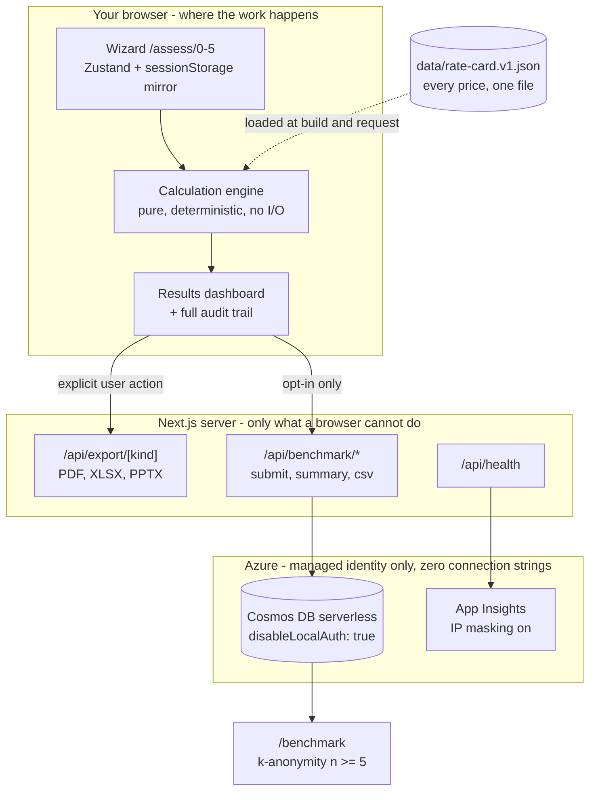

# Copilot Credit Compass

**Estimate what Microsoft Copilot credits will actually cost you, and decide how
to buy them.**

Answer six screens of questions about your organisation and how you intend to
use Copilot. Get a credit forecast with a scenario band, a twelve-month cost,
all eight funding routes compared side by side, an explicit recommendation with
the reasoning shown, and a full audit trail of every calculation.

Then take it away as a board pack (PDF), a working financial model with **live
formulas** (XLSX), or a six-slide deck (PPTX).

[](https://portal.azure.com/#create/Microsoft.Template/uri/https%3A%2F%2Fraw.githubusercontent.com%2FOWNER%2Fcopilot-credit-compass%2Fmain%2Fazuredeploy.json/createUIDefinitionUri/https%3A%2F%2Fraw.githubusercontent.com%2FOWNER%2Fcopilot-credit-compass%2Fmain%2FcreateUiDefinition.json)

> Replace `OWNER` in the badge URL with your GitHub org or username once the
> repository is pushed. The portal fetches `azuredeploy.json` and
> `createUiDefinition.json` over raw HTTPS, so both must be reachable.

---

## Why it exists

Copilot's consumptive pricing is genuinely hard to reason about. Credits are
consumed at different rates by different workloads, some consumption is offset
by a Microsoft 365 Copilot licence, capacity packs do not roll over, and
pre-purchase plans trade flexibility for a discount. The result is that most
organisations either guess, or get quoted a number they cannot interrogate.

This tool produces a number you *can* interrogate. Every figure traces back to a
line in a single JSON rate card, with a source link. The maths is shown, not
asserted.

**It is a planning estimate, not a quote.** It models published list pricing.
Negotiated discounts are not public and are not modelled.

---

## Privacy in one paragraph

There is nothing sensitive to leak. No accounts, no sign-in, no server-side
session. Your inputs live in your browser tab and are never transmitted unless
you explicitly opt in to the anonymous benchmark — and if you do, you can read
the literal JSON payload on `/privacy` before you press the button. No tracking
cookies, no analytics scripts, no IP addresses stored anywhere. See
[PRIVACY.md](PRIVACY.md).

---

## Architecture



The shape of that diagram is the point: **the browser does the work**. The
server exists only for the three things a browser genuinely cannot do — render
Office documents, aggregate a benchmark, and report health.

---

## Quick start

Requires **Node 24+** and **npm 11+**.

```bash
npm install
npm run dev
```

Open <http://localhost:3000>. That is the whole setup. No database, no emulator,
no Azure account, no environment variables. The app falls back to a file-backed
store at `.data/benchmark.jsonl` (git-ignored), so the benchmark works too.

Requiring infrastructure just to see whether software works is a bad first
impression, so the default path does not.

---

## Commands

| Command | What it does |
| --- | --- |
| `npm run dev` | Development server |
| `npm run build` | Production build (standalone output) |
| `npm start` | Serve the production build |
| `npm run lint` | ESLint, including the rule that bans hard-coded prices |
| `npm run typecheck` | `tsc --noEmit`, strict mode |
| `npm test` | Vitest — 432 tests |
| `npm run test:coverage` | Coverage, gated at 95% branch on `lib/engine/**` |
| `npm run test:e2e` | Playwright — wizard, exports, axe-core in both themes |
| `npm run bicep:build` | Recompile `infra/main.bicep` to `azuredeploy.json` |

---

## Updating a price

Edit **one file**: `data/rate-card.v1.json`.

Every rate carries a `sourceUrl` and a `verified` flag. Unverified rates render
with a visible chip in the UI and in every export, so nobody quotes an inferred
number to a CFO by accident.

When you change a rate, add a `changelog` entry in the same edit — it lives
inside the rate card, so it cannot drift, and `/methodology` renders it.

Prices are **never** hard-coded in TypeScript. An ESLint `no-restricted-syntax`
rule fails the build if you try, because a convention nobody checks is a
convention that erodes.

The rate card version and effective date appear on the results page and are
stamped on every PDF, XLSX and PPTX.

---

## Cosmos DB (optional)

The app runs perfectly without it. Configure Cosmos only if you want benchmark
data to persist beyond a single machine.

### Local emulator

Install the [Azure Cosmos DB Emulator](https://learn.microsoft.com/azure/cosmos-db/how-to-develop-emulator),
then:

```powershell
# Start the emulator (Windows)
& "$env:ProgramFiles\Azure Cosmos DB Emulator\Microsoft.Azure.Cosmos.Emulator.exe" /NoFirewall

# Trust its self-signed certificate for Node
$cert = Get-ChildItem Cert:\CurrentUser\My |
  Where-Object { $_.FriendlyName -eq 'DocumentDbEmulatorCertificate' }
Export-Certificate -Cert $cert -FilePath "$PWD\.data\cosmos-emulator.cer"
$env:NODE_EXTRA_CA_CERTS = "$PWD\.data\cosmos-emulator.cer"
```

Create `.env.local`:

```ini
PERSISTENCE_MODE=cosmos
COSMOS_ENDPOINT=https://localhost:8081
COSMOS_DATABASE=compass
COSMOS_CONTAINER=benchmark
# Emulator only - this is the documented, public, well-known emulator key.
# It does not exist in Azure and cannot be used there.
COSMOS_KEY=C2y6yDjf5/R+ob0N8A7Cgv30VRDJIWEHLM+4QDU5DE2nQ9nDuVTqobD4b8mGGyPMbIZnqyMsEcaGQy67XIw/Jw==
```

The emulator dashboard is at <https://localhost:8081/_explorer/index.html>.

To return to the zero-dependency path, set `PERSISTENCE_MODE=file` or remove the
variables.

### In Azure

`COSMOS_KEY` does not exist in Azure and cannot. The deployed Cosmos account is
provisioned with `disableLocalAuth: true`, so no key can be issued at all —
authentication is a user-assigned managed identity holding the built-in Cosmos
Data Contributor role. The Container App ships with an **empty `secrets` array**.

---

## Deploying

### One click

Use the Deploy to Azure button above. The portal experience
(`createUiDefinition.json`) asks for four things: application settings, scale and
cost, security and networking, and tags.

### From the CLI

```bash
az group create --name rg-compass --location uksouth

az deployment group create \
  --resource-group rg-compass \
  --template-file infra/main.bicep \
  --parameters namePrefix=compass \
               containerImage=ghcr.io/OWNER/copilot-credit-compass:latest
```

### From CI

`.github/workflows/deploy.yml` uses **OIDC federated credentials** — no secret in
this repository can deploy anything. It builds and pushes to GHCR, deploys, then
blocks until a revision reports healthy and smoke-tests the live URL.

Set these repository *variables* (not secrets): `AZURE_CLIENT_ID`,
`AZURE_TENANT_ID`, `AZURE_SUBSCRIPTION_ID`, `AZURE_RESOURCE_GROUP`,
`AZURE_LOCATION`, `AZURE_NAME_PREFIX`.

### What gets provisioned

Log Analytics → Application Insights (IP masking on) → user-assigned managed
identity → serverless Cosmos DB (local auth disabled) → Container Apps
environment → Container App (scales 0–5) → optionally Front Door + WAF.

Scale-to-zero and serverless Cosmos are deliberate: an assessment tool nobody
uses continuously should cost pennies while idle.

---

## Project layout

```
data/rate-card.v1.json     Every price. The single source of truth.
lib/engine/                Pure calculation. No I/O, no clock, no randomness.
lib/benchmark/             k-anonymity roll-up, outlier rejection, percentiles.
lib/db/                    Store interface plus Cosmos and file adapters.
lib/export/                PDF, XLSX, PPTX builders. copy.ts holds legal text.
components/wizard/         Steps 0-5, running estimate, field primitives.
components/results/        Dashboard, charts, funding comparison, audit trail.
app/assess/[step]/         URL-addressable wizard.
app/results/               Results dashboard.
app/benchmark/             Public anonymised benchmark.
app/methodology/           Renders the live rate card and every formula.
app/privacy/               Shows the literal benchmark payload.
app/api/                   export, benchmark, health
infra/main.bicep           Infrastructure. Compiles to azuredeploy.json.
tests/e2e/                 Playwright: wizard, exports, axe-core.
```

---

## Accessibility

Zero axe-core violations across `/`, `/assess/0`, `/assess/2`, `/benchmark`,
`/methodology`, `/privacy` and `/results` — in **both** light and dark themes.
Headless Chrome reports a light colour preference, so testing a single theme
would have silently skipped the other.

- Full keyboard path through the wizard, asserted in Playwright.
- The running estimate is `aria-live="polite"` — screen-reader users get the
  same live feedback sighted users do.
- Every chart renders its data as a **real `<table>`**; the visual is decorative.
- Motion sits inside `prefers-reduced-motion: no-preference`.

Four genuine defects were found on the first axe run and fixed at the cause,
never asserted away. They are listed in [DECISIONS.md](DECISIONS.md) §6.

---

## Documentation

| Document | Contents |
| --- | --- |
| [SPEC.md](SPEC.md) | The authoritative specification this was built against |
| [METHODOLOGY.md](METHODOLOGY.md) | Every formula, assumption and limitation |
| [PRIVACY.md](PRIVACY.md) | The full privacy posture, with the literal payload |
| [DECISIONS.md](DECISIONS.md) | Sixty judgement calls and the reasoning behind each |

`/methodology` and `/privacy` are also live pages, and they render the *actual
loaded rate card* rather than a copy — so they cannot drift from what the engine
used.
